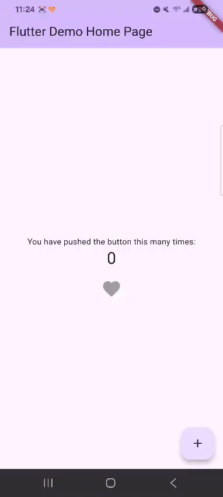

# Animated Fav Button 💖

A Flutter package for creating animated favorite buttons with attractive visual effects like hearts, likes, and other reactions.



## Features ✨

- 🎨 **Smooth animations**: Fluid transitions and attractive visual effects
- 🎯 **Customizable**: Fully configurable colors, icons, and effects
- 💫 **Splash effects**: Animated particles when the button is activated
- 🔧 **Easy to use**: Simple and intuitive API
- 📱 **Responsive**: Adapts to different screen sizes
- ⚡ **Optimized performance**: Efficient animations without performance impact

## Installation 📦

Add `animated_fav_button` to your `pubspec.yaml` file:

```yaml
dependencies:
  animated_fav_button: ^0.0.1
```

Then run:

```bash
flutter pub get
```

## Basic Usage 🚀

```dart
import 'package:animated_fav_button/animated_react_button.dart';

AnimatedReactButton(
  reactColor: Colors.pink,
  defaultColor: Colors.grey,
  onPressed: () {
    // Your logic here
    print('Button pressed!');
  },
)
```

## Complete Example 📝

```dart
import 'package:flutter/material.dart';
import 'package:animated_fav_button/animated_react_button.dart';

class MyFavoriteButton extends StatefulWidget {
  @override
  _MyFavoriteButtonState createState() => _MyFavoriteButtonState();
}

class _MyFavoriteButtonState extends State<MyFavoriteButton> {
  bool isFavorite = false;

  @override
  Widget build(BuildContext context) {
    return Scaffold(
      appBar: AppBar(title: Text('Animated Fav Button Demo')),
      body: Center(
        child: AnimatedReactButton(
          isFavorite: isFavorite,
          reactColor: Colors.red,
          defaultColor: Colors.grey,
          iconSize: 40,
          showSplash: true,
          splashIcons: [Icons.favorite, Icons.star],
          splashColors: [Colors.red, Colors.pink, Colors.orange],
          onPressed: () {
            setState(() {
              isFavorite = !isFavorite;
            });
          },
        ),
      ),
    );
  }
}
```

## Available Properties ⚙️

| Property | Type | Default | Description |
|----------|------|---------|-------------|
| `defaultColor` | `Color` | `Colors.grey` | Icon color when not activated |
| `defaultIcon` | `IconData` | `Icons.favorite` | Icon to display |
| `reactColor` | `Color` | **Required** | Icon color when activated |
| `onPressed` | `Function` | **Required** | Callback when button is pressed |
| `showSplash` | `bool` | `true` | Whether to show particle effect |
| `iconSize` | `double` | `35` | Icon size |
| `enableTap` | `bool` | `true` | Enable or disable interaction |
| `splashIcons` | `List<IconData>` | `[Icons.pets]` | List of icons for splash effect |
| `splashColors` | `List<Color>` | `[Colors.red, Colors.orange, Colors.yellow, Colors.pink]` | Colors for particles |
| `isFavorite` | `bool` | `false` | Initial state of the button |

## Advanced Customization 🎨

### Different Icons
```dart
AnimatedReactButton(
  defaultIcon: Icons.thumb_up,
  splashIcons: [Icons.thumb_up, Icons.star, Icons.favorite],
  reactColor: Colors.blue,
  // ... other properties
)
```

### Custom Colors
```dart
AnimatedReactButton(
  reactColor: Color(0xFF6C63FF),
  defaultColor: Color(0xFFE0E0E0),
  splashColors: [
    Color(0xFF6C63FF),
    Color(0xFF9C88FF),
    Color(0xFFD0C3FF),
  ],
  // ... other properties
)
```

### Without Splash Effects
```dart
AnimatedReactButton(
  showSplash: false,
  reactColor: Colors.green,
  // ... other properties
)
```

## Use Cases 💡

- ✅ "Like" buttons in social media
- ✅ Favorites in e-commerce applications
- ✅ Reactions in chat applications
- ✅ Bookmarks in reading applications
- ✅ Content saving
- ✅ Any interaction requiring visual feedback

## System Requirements 📋

- Flutter SDK: `>=1.17.0`
- Dart SDK: `>=2.16.2 <3.0.0`

## Contributing 🤝

Contributions are welcome! If you find a bug or have a suggestion:

1. Fork the project
2. Create a feature branch (`git checkout -b feature/AmazingFeature`)
3. Commit your changes (`git commit -m 'Add some AmazingFeature'`)
4. Push to the branch (`git push origin feature/AmazingFeature`)
5. Open a Pull Request

## License 📄

This project is licensed under the MIT License. See the [LICENSE](LICENSE) file for more details.

## Author 👨‍💻

**GioRey** - [GitHub](https://github.com/GioRey)

---

## Support 💬

If you have questions or need help:

- 📧 Open an issue on GitHub
- ⭐ Give the project a star if you found it useful
- 🐛 Report bugs to improve the package

Thanks for using Animated Fav Button! 🚀
